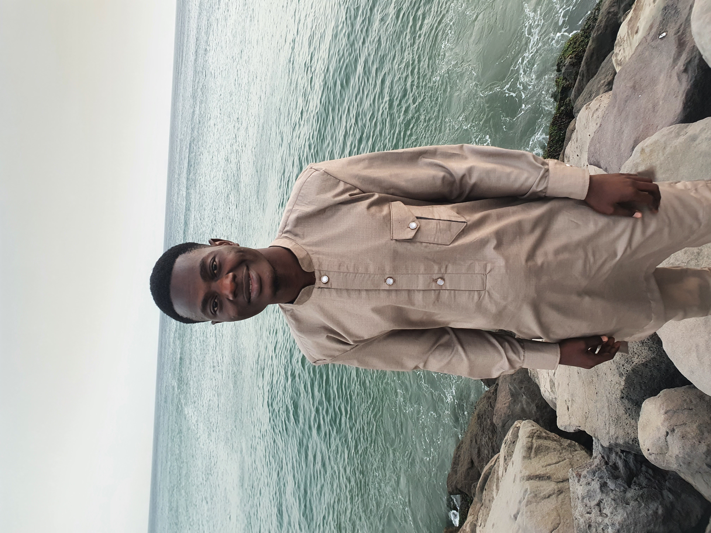

<!DOCTYPE html>
<html lang="fr">
<head>
  <meta charset="UTF-8" />
  <meta name="viewport" content="width=device-width, initial-scale=1" />
  <title>Portfolio - Daouda Ba</title>
  <link href="https://cdn.jsdelivr.net/npm/bootstrap@5.3.3/dist/css/bootstrap.min.css" rel="stylesheet">
  <link href="https://cdn.jsdelivr.net/npm/bootstrap-icons@1.10.5/font/bootstrap-icons.css" rel="stylesheet">
  
</head>
<body>

<!-- En-tête -->
<header class="bg-primary text-white text-center py-5">
  
  <h1 class="mt-3">Daouda Ba</h1>
  
Étudiant en Master Informatique – UCAD, Dakar

</header>

<!-- Navigation -->
<nav class="navbar navbar-expand-lg navbar-light bg-white shadow-sm sticky-top">
  

    <ul class="navbar-nav gap-3">
      <li class="nav-item"><a class="nav-link fw-bold" href="#about">À propos</a></li>
      <li class="nav-item"><a class="nav-link fw-bold" href="#skills">Compétences</a></li>
      <li class="nav-item"><a class="nav-link fw-bold" href="#education">Études</a></li>
      <li class="nav-item"><a class="nav-link fw-bold" href="#languages">Langues</a></li>
      <li class="nav-item"><a class="nav-link fw-bold" href="#interests">Centres d’intérêt</a></li>
      <li class="nav-item"><a class="nav-link fw-bold" href="#contact">Contact</a></li>
    </ul>
  

</nav>

<!-- À propos -->
<section id="about" class="container text-center py-5">
  <h2 class="section-title">À propos de moi</h2>
  
Étudiant en Informatique, rigoureux, sociable et passionné par le travail en équipe. Actuellement en Master à l’UCAD en Systèmes d’Information Répartis.

</section>

<!-- Compétences -->
<section id="skills" class="bg-light py-5">
  

    <h2 class="text-center section-title">Compétences</h2>
    

      

<i class="bi bi-code-slash text-warning"></i> HTML, CSS, JavaScript

      

<i class="bi bi-terminal text-primary"></i> C, C++, Java

      

<i class="bi bi-braces text-info"></i> Java EE, JDBC

      

<i class="bi bi-phone text-success"></i> Flutter, Dart

      

<i class="bi bi-database text-danger"></i> MySQL, PostgreSQL, Oracle

      

<i class="bi bi-windows text-dark"></i> Word, Excel, PowerPoint

    

  

</section>

<!-- Études -->
<section id="education" class="container py-5">
  <h2 class="text-center section-title">Études et formation</h2>
  

    

<i class="bi bi-mortarboard text-warning"></i> Master 1 – UCAD (2024-2025)

    

<i class="bi bi-mortarboard text-warning"></i> Licence Informatique – UCAD (2021-2024)

    

<i class="bi bi-book text-primary"></i> Bac S1 – Lycée de Ourossogui (2020)

    

<i class="bi bi-book text-primary"></i> BFEM – Collège de Aoure (2017)

    

<i class="bi bi-book text-primary"></i> CFEE – École de Koly (2013)

  

</section>

<!-- Langues -->
<section id="languages" class="bg-light py-5">
  

    <h2 class="text-center section-title">Langues parlées</h2>
    

      

        

          

            <h5>Français</h5>
            
Très bon niveau

          

          <small class="flag">🇫🇷</small>
        

      

      

        

          

            <h5>Anglais</h5>
            
Bon niveau

          

          <small class="flag">🇺🇸</small>
        

      

      

        

          

            <h5>Arabe</h5>
            
Niveau moyen

          

          <small class="flag">🇸🇦</small>
        

      

      

        

          

            <h5>Poular</h5>
            
Langue maternelle

          

          <small class="flag">🇸🇳</small>
        

      

      

        

          

            <h5>Wolof</h5>
            
Bon niveau

          

          <small class="flag">🇸🇳</small>
        

      

    

  

</section>

<!-- Centres d’intérêt -->
<section id="interests" class="container py-5">
  <h2 class="text-center section-title">Centres d’intérêt</h2>
  

    

<i class="bi bi-trophy text-warning"></i> Football

    

<i class="bi bi-music-note-beamed text-danger"></i> Musique

    

<i class="bi bi-book text-primary"></i> Lecture

  

</section>

<!-- Contact -->
<section id="contact" class="bg-light py-5">
  

    <h2 class="section-title">Contact</h2>
    
<i class="bi bi-envelope text-warning"></i> daoudaba2001@gmail.com

    
<i class="bi bi-phone text-success"></i> +221 78 541 76 19

    
<i class="bi bi-geo-alt text-danger"></i> Médina Rue 37x32, Dakar

    

      <a href="https://www.facebook.com/daouda.ba.802206" class="btn btn-outline-primary me-2" target="_blank"><i class="bi bi-facebook"></i> Facebook</a>
      <a href="https://twitter.com/daoudaba" class="btn btn-outline-info me-2" target="_blank"><i class="bi bi-twitter"></i> Twitter</a>
      <a href="https://www.instagram.com/daoudaba.17/" class="btn btn-outline-danger me-2" target="_blank"><i class="bi bi-instagram"></i> Instagram</a>
      <a href="https://wa.me/221785417619" class="btn btn-outline-success" target="_blank"><i class="bi bi-whatsapp"></i> WhatsApp</a>
    

  

</section>

<!-- Pied de page -->
<footer class="bg-dark text-white text-center py-4">
  &copy; 2025 Daouda Ba. Tous droits réservés.
</footer>

</body>
</html>
